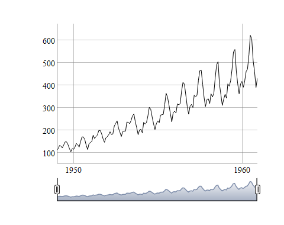
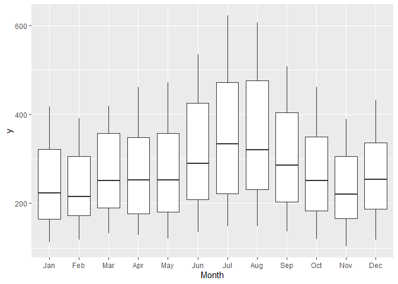
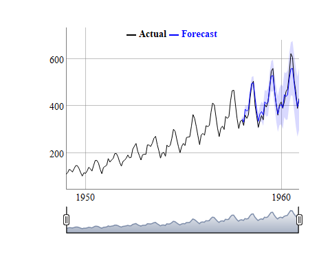
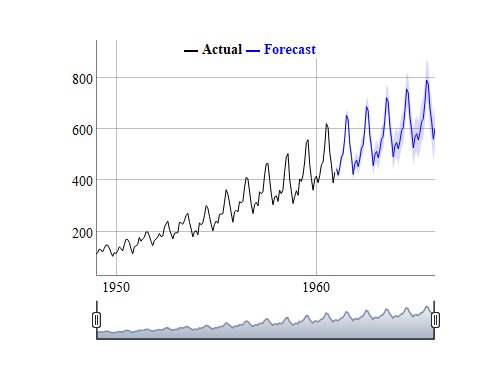

<!-- README.md is generated from README.Rmd. Please edit that file -->

# tsfuncs

<!-- badges: start -->

<!-- badges: end -->

The goal of tsfuncs is to aid in visualizing and summarizing time series
data and forecasts.

## Installation

You can install the released version of tsfuncs from
[GitHub](https://github.com/travisandersen14/tsfuncs) with:

``` r
devtools::install_github("travisandersen14/tsfuncs")
```

## Example

This is a basic example which shows you how to solve a common problem
with tsfuncs. tsfuncs is designed to work with the tidyverse. We will
also load the fpp3 package for modeling.

``` r
library(tsfuncs)
library(tidyverse)
library(fpp3)
```

### Exploratory Data Analysis

In this example the AirPassengers dataset from the datasets package will
be used. It is a dataset with monthly totals of international airline
passengers from 1949 to 1960. It is loaded as a time series in R, but
for this example we will convert it to a tibble. tsfuncs is designed to
work with tibbles as to allow access to the tidyverse.

``` r
df <- tibble(
  ds = seq(as_date('1949-01-01'), as_date('1960-12-01'), 'month'),
  y = as.numeric(AirPassengers)
)
head(df)
#> # A tibble: 6 x 2
#>   ds             y
#>   <date>     <dbl>
#> 1 1949-01-01   112
#> 2 1949-02-01   118
#> 3 1949-03-01   132
#> 4 1949-04-01   129
#> 5 1949-05-01   121
#> 6 1949-06-01   135
```

We can create an interactive exploratory graph of the data with
ts\_graph as follows:

``` r
ts_graph(df)
```



We can also explore possible seasonality patterns with ts\_seasonality.

``` r
ts_seasonality(df, 'monthly')
```



### Cross Validation

To test the predictive ability of an ARIMA model, a cross validation was
run using the last three years of the data as a testing period, and
training the model on the remaining data. In this example, the fpp3
library was used to fit the ARIMA model. The forecast data is then
merged with the original data to create a tibble with columns ‘ds’, ‘y’,
‘yhat’, ‘yhat\_lower’, and ‘yhat\_upper’.

    #> # A tibble: 6 x 5
    #>   ds             y  yhat yhat_lower yhat_upper
    #>   <date>     <dbl> <dbl>      <dbl>      <dbl>
    #> 1 1949-01-01   112    NA         NA         NA
    #> 2 1949-02-01   118    NA         NA         NA
    #> 3 1949-03-01   132    NA         NA         NA
    #> 4 1949-04-01   129    NA         NA         NA
    #> 5 1949-05-01   121    NA         NA         NA
    #> 6 1949-06-01   135    NA         NA         NA

We can assess fit with ts\_graph as follows:

``` r
ts_graph(cv_df)
```



We can also calculate accuracy metrics over the testing period with
ts\_accuracy.

``` r
ts_accuracy(cv_df)
#> # A tibble: 1 x 5
#>      ME   MAE  MASE Coverage Width
#>   <dbl> <dbl> <dbl>    <dbl> <dbl>
#> 1 -1.48  17.8 0.689    0.917  131.
```

### Forecast

The data was then forecast for the following five years using an ARIMA
model. The fpp3 package will be used again for the modeling.

``` r
fc <- df %>% 
  mutate_at('ds', yearmonth) %>% 
  as_tsibble(index = ds) %>% 
  model(ARIMA(y)) %>% 
  forecast(h = 60) %>% 
  hilo(80) %>% 
  as_tibble %>% 
  transmute(ds = as_date(ds), yhat = y, yhat_lower = map_dbl(`80%`, 1), yhat_upper = map_dbl(`80%`, 2))

fc_df <- full_join(df, fc, 'ds')
head(fc_df)
#> # A tibble: 6 x 5
#>   ds             y  yhat yhat_lower yhat_upper
#>   <date>     <dbl> <dbl>      <dbl>      <dbl>
#> 1 1949-01-01   112    NA         NA         NA
#> 2 1949-02-01   118    NA         NA         NA
#> 3 1949-03-01   132    NA         NA         NA
#> 4 1949-04-01   129    NA         NA         NA
#> 5 1949-05-01   121    NA         NA         NA
#> 6 1949-06-01   135    NA         NA         NA
```

We can now view the resulting forecast using ts\_graph.

``` r
ts_graph(fc_df)
```


